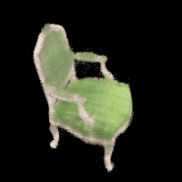

# NeRF : Implemented in pytorch.

The goal of this repository is to gain a comprehensive understanding of NeRF and Volumetric Rendering. 

## Notebooks

The entire implementation was initially done in Jupyter Notebooks, ensuring a step-by-step understanding and testing:

1. [1_camera_rays.ipynb](./1_camera_rays.ipynb)
2. [2_load_dataset.ipynb](./2_load_dataset.ipynb)
3. [3_volumetric_rendering.ipynb](./3_volumetric_rendering.ipynb)
4. [4_voxel_reconstruction.ipynb](./4_voxel_reconstruction.ipynb)
5. [5_train_nerf.ipynb](./5_train_nerf.ipynb)

## Python Source Files

After testing in notebooks, the implementation was converted to Python source files, located in the `/src` directory:

- [nerf_dataset.py](./src/nerf_dataset.py)
- [model.py](./src/model.py)
- [utils.py](./src/utils.py)
- [networks.py](./src/networks.py)
- [camera.py](./src/camera.py)

## Visualizations

Visual results achieved using the NeRF implementation on a chair dataset:

- The result of Voxel Reconstruction:

- The result of NeRF Output:

- Training Visualization:

## References

- [NeRF: Representing Scenes as Neural Radiance Fields for View Synthesis](https://arxiv.org/pdf/2003.08934v2.pdf)
- [scratchapixel](https://www.scratchapixel.com/)
